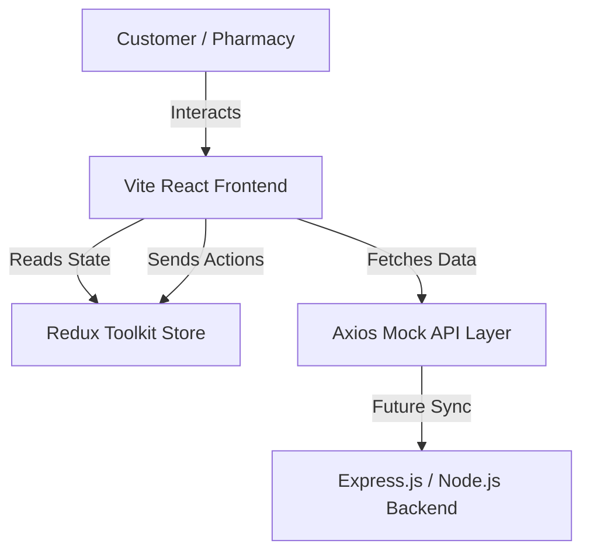

# Medical Plus - Graduation Project Documentation

## 🏥 Project Overview
**Medical Plus (SereneMeds)** is a modern pharmacy-ordering and medicine-discovery platform built using **React, TypeScript, Redux Toolkit, and Bootstrap**. The platform serves two primary user roles:
1. **Customers/Visitors**: Who can search for medicines (especially hard-to-find ones) near their location, upload prescriptions, and place orders.
2. **Pharmacies**: Who can manage their inventory, accept/reject incoming orders, and track sales performance via an interactive Admin Dashboard.
3. **Ministry of Health (Future Vision)**: Serving as a central hub to monitor medicine distribution, track critical drug withdrawals, and manage supplies across different regions.

---

## 📅 1. Project Planning & Management

### Methodology
The team adopted the **Agile Scrum** framework to manage the development process. Sprints were organized bi-weekly with clear goals defined before coding began.

### Team Roles & Responsibility Matrix
- **Mohammed Eid** (Team Leader): Project coordination, liaison with the Ministry and AST instructors, task tracking.
- **Ahmed Magdy** (Technical Lead): Repository management, system architecture design, component structure setup, state management (Redux Toolkit Integration).
- **Mohammed Ahmed Shereen** (Frontend Developer): Authentication module (LoginForm, SignupForm with strict validations), Information views (FAQ Page, contact/feedback logic).
- **Mahmoud Abdel-Aal** (Frontend Developer): Homepage layout, pharmacy directory mapping, interactive components, and Pharmacy Admin Dashboard.
- **Mariam Alaa** (Frontend Developer): Product listing page, advanced category filters, cart management, and checkout ordering flow.

### Management Tools
- **GitHub**: Repository hosting and collaborative coding.
- **Jira**: Task assignment, backlog management, and sprint progression tracking.
- **WhatsApp / Zoom**: Weekly check-ins, sprint reviews, and pair-programming sessions.

---

## 📚 2. Literature Review & Competitor Analysis

To ensure our platform addresses real-world gaps, we analyzed existing healthcare applications in Egypt:

| Feature | Yodawy (يدوي) | Chefaa (شفاء) | Talabat (Pharmacy) | **Medical Plus (Our Project)** |
| :--- | :--- | :--- | :--- | :--- |
| **Primary Focus** | Insurance-based medicine orders | Chronic disease subscription refills | General quick commerce / on-demand | **Medicine availability & Pharmacy Dashboard** |
| **Search Mechanism** | Text search / Image upload | Text search / Subscription | Simple categorizations | **GPS Location, Availability filters, Brand filters** |
| **Prescription Validation** | Handled by backend admin | Handled by Chefaa pharmacists | No specialized prescription validation | **Direct upload to the nearest pharmacist for validation** |
| **B2B Dashboard** | Standard portal | Basic inventory syncing | Partner portal | **Advanced Pharmacy Dashboard (Orders & Stock Control)** |
| **Ministry Monitoring** | None (Commercial) | None (Commercial) | None (Commercial) | **Designed for future Ministry of Health integration** |

### Our Competitive Edge
Unlike generic delivery apps (Talabat) or centralized platforms (Yodawy), **Medical Plus** connects users directly to local physical pharmacies. It focuses heavily on locating **rare and critical medicines** in the immediate vicinity, saving patients precious time during medical emergencies.

---

## 📋 3. Requirements Gathering

### Functional Requirements
#### A. Customer Features
1. **Discovery**: Browse categories, search products by name, sub-category, or active ingredients.
2. **Location-Based Search**: View nearby pharmacies stocking a particular medicine using GPS.
3. **Registration & Auth**: Create accounts with Gmail verification and strong password checks.
4. **Ordering & Prescriptions**: Place orders, upload images of doctor prescriptions for approval.
5. **Order History**: Track current order status (Pending → Preparing → Out for Delivery → Delivered).
6. **Support**: View FAQs and contact the technical team.

#### B. Pharmacy Features
1. **Authentication**: Secure login for pharmacy managers.
2. **Inventory Management**: Update product prices, edit stock quantities, and view alerts for out-of-stock items.
3. **Order Management**: Receive real-time orders, review uploaded prescriptions, and update status.
4. **Analytics**: Track revenue, volume of orders, and peak times.

### Non-Functional Requirements
1. **Performance**: Page load time under 2 seconds (achieved via lazy loading React components).
2. **Usability**: Fully responsive interface using Bootstrap Grid (supporting phones, tablets, and desktops).
3. **Reliability**: Secure client-side state handling via Redux Toolkit.
4. **Validation Integrity**: Robust regex-based validators for Egyptian phone numbers and Gmail domains.

---

## 🎨 4. System Analysis & Design

### High-Level Architecture


### Database Entity-Relationship Schema (Conceptual Model)
```
[USER]
  - id (PK)
  - email (Unique Gmail)
  - password
  - role (Customer / Pharmacist)
  - city
  - phone

[MEDICINE]
  - id (PK)
  - name
  - generic_name
  - brand
  - category
  - price

[ORDER]
  - id (PK)
  - customer_id (FK)
  - pharmacy_id (FK)
  - total_amount
  - status (Pending, Preparing, Shipped, Delivered, Cancelled)
  - items_summary
  - prescription_image_url (Optional)
```

### Main System Workflows
1. **User Sign-up**: User inputs details → Frontend runs validations (phone structure, email validation) → Account created.
2. **Ordering Process**: Customer finds medicine → Add to Cart → Upload prescription (if required) → Order status set to `Pending`.
3. **Pharmacy Fulfillment**: Pharmacist views order in Dashboard → Accepts order (changes status to `Preparing`) → Dispatches order (changes status to `Out for Delivery`) → Customer receives order (`Delivered`).
